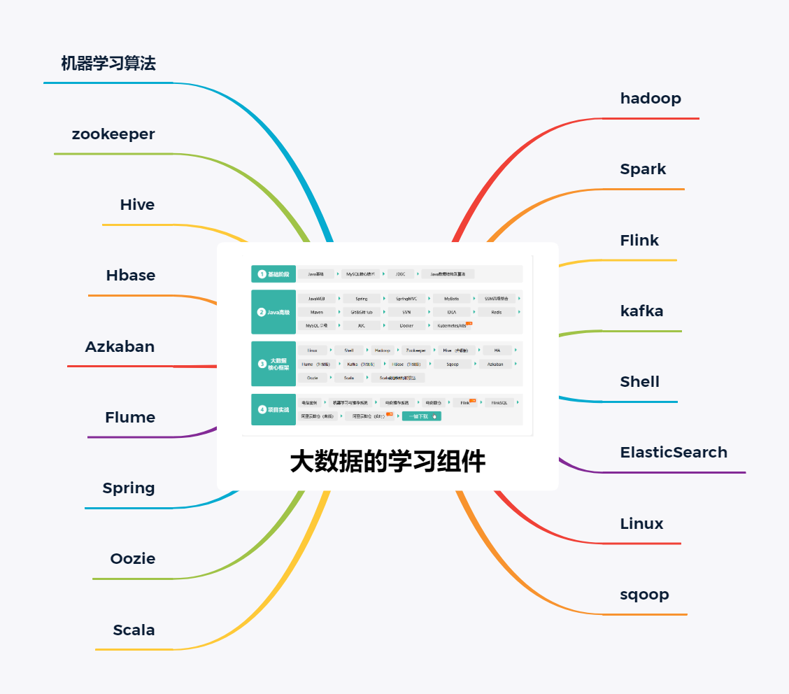

# 庄小焱的大数据仓库
这是个人的大数据仓库，本人将根据以下技术栈路线图不断更新仓库，同时欢迎大家一起建设这个仓库。

#仓库的基础知识
##Scala数据结构与算法
##zookeeper
##Hive
##HBase
##Azkaban
##Flume
##Oozie
##Hadoop
##Spack
##Flink
##kafka
##Shell
##ElasticSearch
##Linux
##Sqop
#仓库的实战项目
##基于hadoop的离线功能实现
##基于hadoop的离线电信系统
##基于hadoop的日志统计系统
##基于SparkStreaming实时电影推荐系统

##基于Hadoop离线和SparkStreaming实时电商统计系统

    
    
